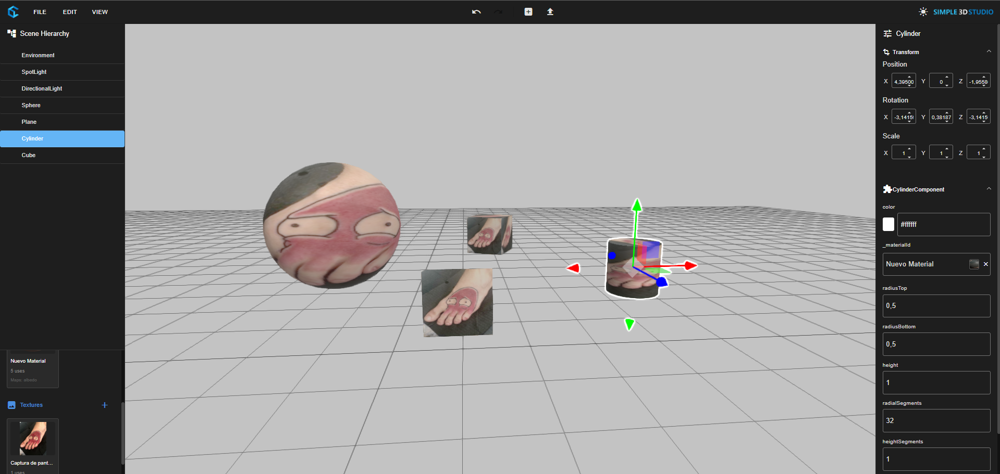

# Three D Web Editor

# Working Features for editor v0.1

- 3D Lib Layer over ThreeJs with Component / Gameobject system like Unity
- Toolbar with submenus
- Context menu with submenus
- Undo/redo transform changes
- Load models into scene
- 3D components UI attributes binding on right sidebar
- Draggable Tree for sort and change 3D Gameobjects hierarchy

# TODO for editor v0.1

- Update editor actions history to be implemented on HistoryService. Will save commands like loadModelCommand, RemoveCommand, MoveCommand, etc.
- Different context menu dependingt right click location
- Change sky/environment by UI
- Dragglabe components to sort them
- Create component button & Selection component dialog
- Export / Import Scene
- Launch scene on viewer
- Launch scene on XR Viewer
- Create Mesh component
- Create Animation component
- Update more existing components for being used on editor
- Create custom components using custom online editor
- Multi user scene edition using existing Sync multiplayer components
- Asset search integration + owned CC0 Assets from Backend

# Proposals

- Marketing campaigns AR / 3D experiences
- 3D Editor for metaverses
- "Roblox" platform letting users publish their own experiences