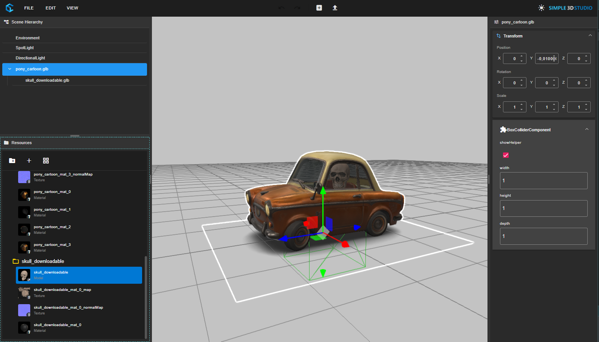
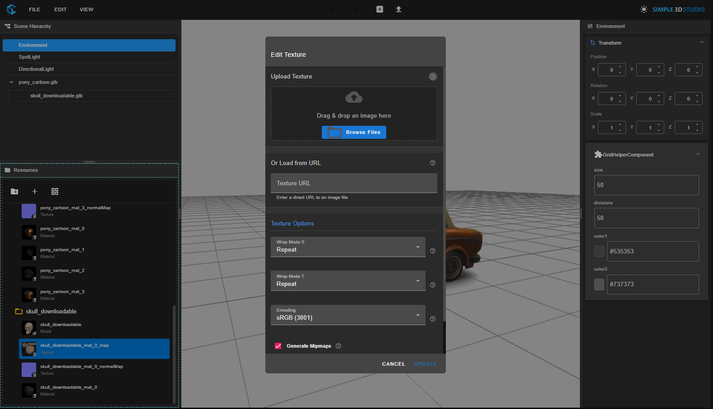

# Three D Web Editor

# Working Features for editor v0.1

- 3D Lib Layer over ThreeJs with Component / Gameobject system like Unity
- Toolbar with submenus
- Context menu with submenus
- Undo/redo transform changes
- Load models into scene
- 3D components UI attributes binding on right sidebar
- Draggable Tree for sort and change 3D Gameobjects hierarchy
- Resource Manager for materials and textures
- Material editor with real-time preview
- Texture selection and management

# Screenshots

## Material Editor

## Texture Manager

# Recent Updates

## Resource Management System

- **UUID-based Resource Tracking**: Implemented a robust UUID-based system for tracking materials and textures, ensuring proper referencing throughout the application.
- **Material Preview System**: Added real-time material previews in the Resource Manager with efficient WebGL rendering.
- **Material Editor**: Created a comprehensive material editor with support for:
  - Basic properties (color, roughness, metalness, transparency)
  - Advanced properties (alpha test, depth test, flat shading)
  - Texture mapping (albedo, normal, roughness, metalness, emissive)
  - Real-time preview with different shapes and lighting conditions

## Material Component Improvements

- **Material Input Component**: Enhanced the material input component to display material previews and handle material selection.
- **Material Selector Dialog**: Implemented a dialog for selecting existing materials with preview thumbnails.
- **Material Dialog Component**: Created a comprehensive dialog for creating and editing materials with real-time preview.

## Texture Management

- **Texture Selection Dialog**: Added a dialog for selecting, uploading, and creating textures from URLs.
- **Texture Preview System**: Implemented texture previews in the Resource Manager and material editor.
- **Texture Reference Management**: Added proper reference counting for textures to prevent memory leaks.

## Bug Fixes and Optimizations

- Fixed issues with material editing and updating
- Improved error handling for texture loading and preview generation
- Enhanced UUID management to ensure proper material and texture referencing
- Optimized WebGL rendering for material previews
- Fixed alignment issues in the material input component
- Improved handling of texture references in materials
- Added robust error handling for WebGL context loss

# TODO for editor v0.1

- Update editor actions history to be implemented on HistoryService. Will save commands like loadModelCommand, RemoveCommand, MoveCommand, etc.
- Different context menu depending on right click location
- Change sky/environment by UI
- Draggable components to sort them
- Create component button & Selection component dialog
- Export / Import Scene
- Launch scene on viewer
- Launch scene on XR Viewer
- Create Mesh component
- Create Animation component
- Update more existing components for being used on editor
- Create custom components using custom online editor
- Multi user scene edition using existing Sync multiplayer components
- Asset search integration + owned CC0 Assets from Backend

# Proposals

- Marketing campaigns AR / 3D experiences
- 3D Editor for metaverses
- "Roblox" platform letting users publish their own experiences

# Development

## Getting Started

1. Clone the repository
2. Run `npm install` to install dependencies
3. Run `ng serve` to start the development server
4. Navigate to `http://localhost:4200/` in your browser

## Key Components

- **ResourceService**: Manages materials and textures with UUID-based tracking
- **ResourceManagerComponent**: UI for managing materials and textures
- **MaterialDialogComponent**: Dialog for creating and editing materials
- **TextureSelectionDialogComponent**: Dialog for selecting and creating textures
- **MaterialInputComponent**: Component for selecting materials in the editor

## Architecture

The editor uses a component-based architecture similar to Unity, with a clear separation between:

- **Editor UI**: Angular components for the editor interface
- **3D Rendering**: Three.js for 3D rendering and scene management
- **Resource Management**: Services for managing materials, textures, and other resources
- **Component System**: A flexible component system for building 3D objects